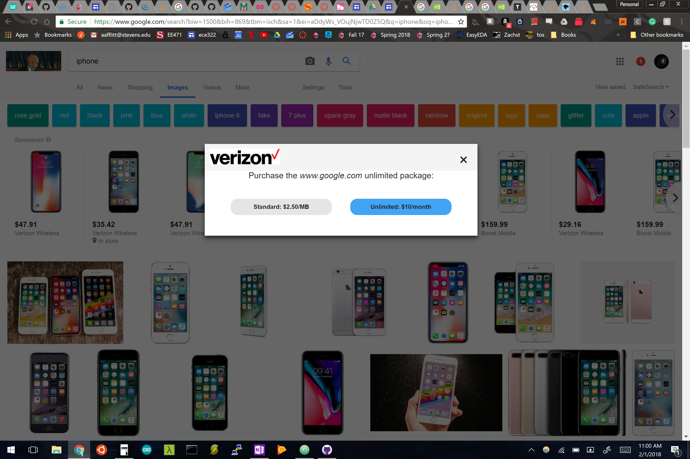

# Net-Neutrality-Simulator
Net Neutrality Simulator is a Chrome extension to simulate web browsing without net neutrality.

# What this extension does
On a loaded page, click the extension icon to start the simulation. First, the page will go blank and slowly reload. This simulates what it would be like to browse the web on a slow connection.

Next, a popup comes up asking if you would like to purchase the "unlimited" package for this site for $10, or continue browsing at a fixed cost per megabyte.

If you click unlimited, the bottom right corner of the page will show you that the current browsing session costs $10. If you click standard, the bottom right will show you an estimated cost of how much the browsing session costs depending on how long you stay on the site.

# Files in this repository
- manifest.json
  - Contains the name, description, and settings for this extension
- background.js
  - JS file that runs in the background and waits for the user to click on the extension
- extension.js
  - JS file that runs when the extension is clicked
- jquery-3.2.1.min.js
  - JQuery file
- icon.png
  - Extension's icon
- Screenshots/
  - Containes screenshots of the extension running
- Sketches/
  - Images of the original sketches and mockups created for Jan 25th
